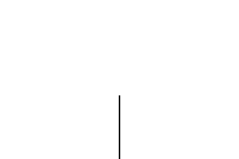
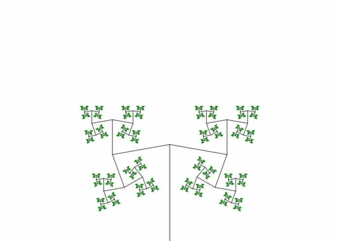

# tree fractal




```
for a in `seq -10 5 65`; do go run main.go -height 500 -width 700 -depth 12 -angle 45 -tilt $a; done; for a in `seq 60 -5 0`; do go run main.go -height 500 -width 700 -depth 12 -angle 45 -tilt $a; done; for a in `seq 45 5 100`; do go run main.go -height 500 -width 700 -depth 12 -angle $a; done
```

